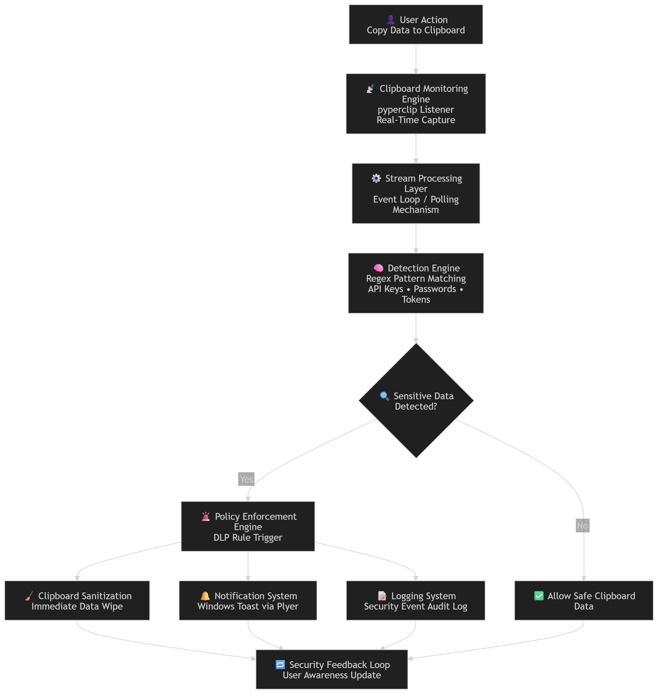
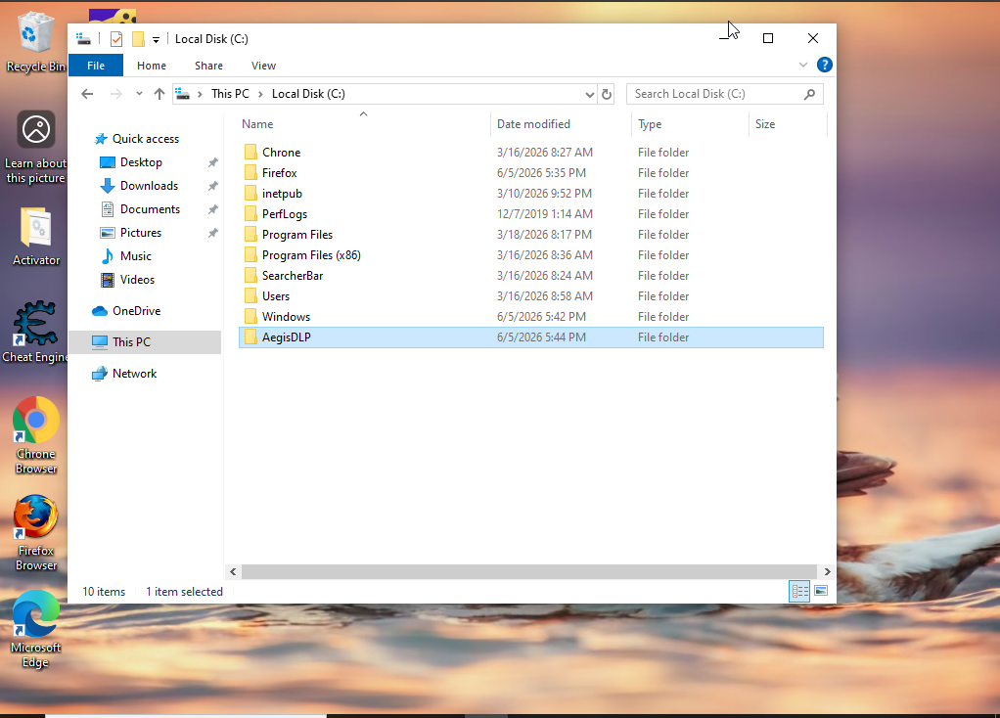
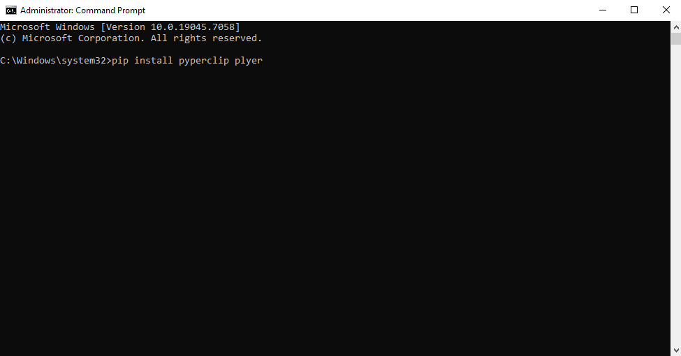

# Aegis-Guard---Intelligent-Clipboard-Data-Loss-Prevention-DLP-

**A lightweight, real-time Windows clipboard monitoring and protection tool that automatically detects and prevents leakage of sensitive data such as API keys.**



---

## Executive Summary

**Aegis Guard** is a practical cybersecurity tool developed to mitigate one of the most common insider threats — **accidental sensitive data exposure via clipboard**. 

This project showcases real-world skills in threat detection, Python automation, regex pattern matching, and endpoint security — making it a strong portfolio piece for **Junior Cyber Analyst**, **SOC Analyst**, or **Security Engineer** roles.

---

## Key Features

- Real-time clipboard monitoring with minimal latency
- Custom regex-based sensitive data detection
- Automatic clipboard sanitization (data destruction)
- Windows toast notifications and console logging
- Silent background operation with low resource usage

---

## Screenshots

### 1. Creating the Project Directory
  
*Creating a dedicated project folder (AegisDLP) on the C: drive for organized development.*

### 2. Navigating to Project Folder in Command Prompt
  
*Using the `cd` command in Command Prompt to enter the project directory.*

### 3. Saving the Python Script
  
*Saving the main Python script (`aegis_guard.py`) inside the project folder.*

### 4. Installing Required Python Packages
  
*Running `pip install pyperclip plyer` to install the required libraries for clipboard access and notifications.*

### 5. Successful Package Installation
  
*Confirmation that `pyperclip` and `plyer` were installed without errors.*

### 6. Aegis Guard Running Successfully
  
*The tool successfully launched and running silently in the background.*

### 7. Crafting the DLP Script (Code View)
  
*View of the main Python script showing rules, monitoring logic, and notification system.*

### 8. Testing with Fake Sensitive Key
  
*Creating a test sensitive key (`sk-...`) in Notepad to simulate a potential data leak.*

### 9. Data Leak Detection & Blocking (Notification)
  
*Windows toast notification triggered when Aegis Guard successfully detected and blocked sensitive data.*

### 10. Console Log - Leak Successfully Destroyed
  
*Console output confirming the detection and destruction of the leaked sensitive data.*

---

## How It Works

1. Continuously monitors the Windows clipboard
2. Scans copied content against predefined security rules using regex
3. Instantly clears any detected sensitive information
4. Displays user-friendly notifications and logs the event

---

## Technology Stack

- **Python 3.11+**
- **pyperclip** – Clipboard manipulation
- **plyer** – Cross-platform notifications
- **re** – Regular expression pattern matching
- **Windows 10/11**

---

---

---

Use Cases

Preventing accidental API key leaks during development
Security awareness demonstrations
Personal defensive security tooling
Portfolio project for junior cybersecurity positions

---

## Installation & Usage

### Prerequisites
- Python 3.11 or higher
- Windows Operating System

### Setup Steps

```bash
git clone https://github.com/yourusername/aegis-guard.git
cd aegis-guard
pip install pyperclip plyer
python aegis_guard.py


